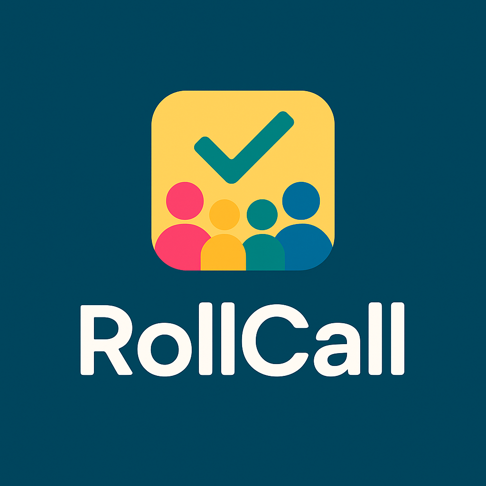

# Roll Call - Modern Group Voting Application

Roll Call is a fully-featured, responsive group voting application built with Next.js, React, and Firebase. It transforms group voting into social media to help you stay connected with those you know.



## Features

- **User Authentication**: Secure email/password authentication with Firebase, plus social login options (Google, Facebook)
- **Poll Creation**: Create custom polls with multiple-choice or yes/no questions
- **Group Management**: Organize friends into groups for targeted polling
- **Real-time Updates**: See poll results update in real-time
- **Data Visualization**: View poll results with interactive charts
- **Responsive Design**: Works seamlessly on mobile and desktop
- **Clean UI**: Modern, minimalist interface with intuitive navigation

## Tech Stack

- **Frontend**: Next.js 14 (App Router), React, TypeScript, Tailwind CSS
- **Backend**: Firebase (Authentication, Firestore, Storage)
- **Data Visualization**: Chart.js with react-chartjs-2
- **Icons**: React Icons
- **Forms**: React Hook Form

## Getting Started

### Prerequisites

- Node.js 18 or higher
- npm or yarn
- Firebase account

### Installation

1. Clone the repository:
```bash
git clone https://github.com/yourusername/rollcall.git
cd rollcall
```

2. Install dependencies:
```bash
npm install
# or
yarn install
```

3. Create a Firebase project:
   - Go to [Firebase Console](https://console.firebase.google.com/)
   - Create a new project
   - Set up Authentication (enable Email/Password, Google, and Facebook if desired)
   - Create a Firestore database
   - Set up Storage

4. Create a `.env.local` file in the root directory with your Firebase configuration:
```
NEXT_PUBLIC_FIREBASE_API_KEY=your-api-key
NEXT_PUBLIC_FIREBASE_AUTH_DOMAIN=your-auth-domain
NEXT_PUBLIC_FIREBASE_PROJECT_ID=your-project-id
NEXT_PUBLIC_FIREBASE_STORAGE_BUCKET=your-storage-bucket
NEXT_PUBLIC_FIREBASE_MESSAGING_SENDER_ID=your-messaging-sender-id
NEXT_PUBLIC_FIREBASE_APP_ID=your-app-id
NEXT_PUBLIC_FIREBASE_MEASUREMENT_ID=your-measurement-id
```

5. Start the development server:
```bash
npm run dev
# or
yarn dev
```

6. Open [http://localhost:3000](http://localhost:3000) in your browser

## Application Structure

```
src/
├── app/                  # Next.js App Router pages
│   ├── (auth)/           # Authentication pages
│   ├── polls/            # Poll-related pages
│   ├── groups/           # Group management pages
│   └── landing/          # Landing page for non-authenticated users
├── components/           # React components
│   ├── auth/             # Authentication components
│   ├── groups/           # Group-related components
│   ├── layout/           # Layout components (Navbar, Footer)
│   └── polls/            # Poll-related components
├── contexts/             # React context providers
│   └── AuthContext.tsx   # Authentication context
├── lib/                  # Utilities and hooks
│   ├── firebase.ts       # Firebase configuration
│   └── hooks/            # Custom React hooks
└── middleware.ts         # Authentication middleware
```

## Key Pages

- `/landing`: Home page for non-authenticated users
- `/auth/signup`: User registration
- `/auth/login`: User login
- `/`: Dashboard with active polls (for authenticated users)
- `/polls`: View all polls
- `/polls/create`: Create a new poll
- `/polls/[id]`: View and vote on a specific poll
- `/polls/[id]/results`: View detailed poll results
- `/groups`: Manage groups
- `/groups/create`: Create a new group

## Firebase Setup Details

### Authentication

Roll Call uses Firebase Authentication for:
- Email/password authentication
- Google OAuth
- Facebook OAuth
- User profile management

### Firestore Database Structure

**Collections:**
- `users`: User profiles
- `polls`: Poll data
- `votes`: Vote records
- `groups`: Group information and members

**Example document structure for polls:**
```json
{
  "id": "poll123",
  "title": "Team Outing",
  "description": "Vote on team outing ideas",
  "createdBy": "user456",
  "createdAt": "Timestamp",
  "endDate": "Timestamp",
  "options": [
    { "id": "option1", "text": "Bowling", "votes": 5 },
    { "id": "option2", "text": "Hiking", "votes": 3 }
  ],
  "groupId": "group789", // optional
  "isPrivate": false,
  "coverPhotoUrl": "https://example.com/image.jpg" // optional
}
```

## Customization

You can customize the application by:
- Modifying the color scheme in `tailwind.config.ts`
- Adding/removing authentication providers in `src/lib/firebase.ts`
- Customizing poll types in `src/components/polls/PollForm.tsx`

## Deployment

The easiest way to deploy Roll Call is using Vercel:

1. Push your code to a GitHub repository
2. Import the project in Vercel
3. Set environment variables for your Firebase configuration
4. Deploy!

## License

This project is licensed under the MIT License - see the LICENSE file for details.

## Acknowledgements

- UI design inspired by modern voting applications
- Icons from [React Icons](https://react-icons.github.io/react-icons/)
- Charts powered by [Chart.js](https://www.chartjs.org/) and [react-chartjs-2](https://react-chartjs-2.js.org/)
